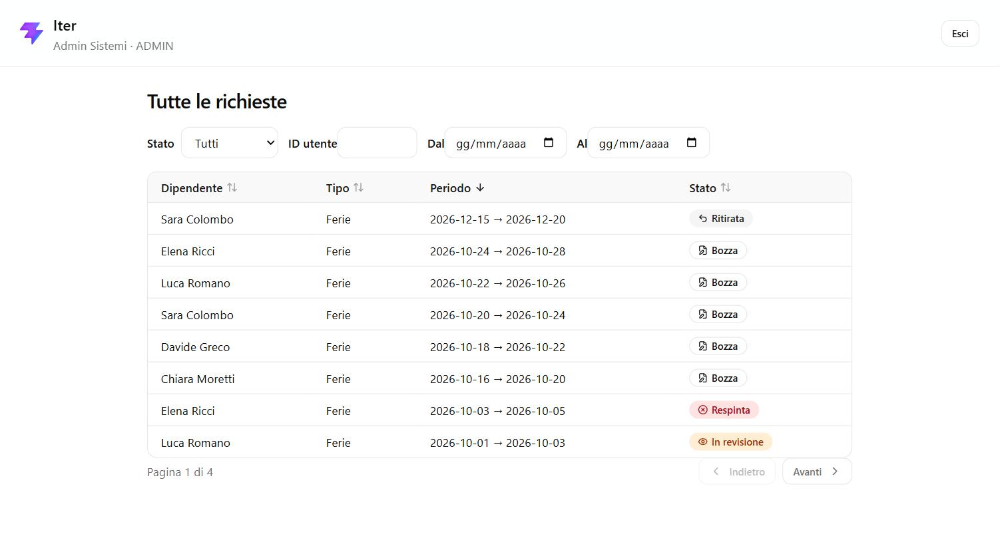

# Iter


Gestionale di richieste di ferie e permessi con workflow di approvazione a tre ruoli (dipendente, responsabile, admin). Ogni richiesta segue una macchina a stati validata lato server, e ogni cambio di stato resta scritto in un registro eventi immutabile.



## Indice

- [Avvio in locale](#avvio-in-locale)
- [Utenti demo](#utenti-demo)
- [Scelte tecniche](#scelte-tecniche)
- [Stack](#stack)
- [Deploy](#deploy)

## Avvio in locale

Serve solo Docker.

```bash
git clone https://github.com/dodoshell/iter.git
cd iter
docker compose up
```

- Frontend: http://localhost:5173
- Backend: http://localhost:8080/api
- Al primo avvio Flyway crea lo schema e carica i dati demo (8 utenti, 30 richieste distribuite su tutti gli stati).

## Utenti demo

Password per tutti: **`Password123!`**

| Ruolo | Email | Cosa vedere |
|---|---|---|
| Dipendente | `sara.colombo@iter.dev` | Le proprie richieste, form di creazione, invio/ritiro |
| Responsabile | `giulia.ferrari@iter.dev` | Coda del team (manager di Sara, Luca, Elena), approvazione/rifiuto |
| Admin | `admin@iter.dev` | Tutte le richieste dell'azienda, filtrabili, sola lettura |

## Scelte tecniche

**Macchina a stati centralizzata.** Le transizioni ammesse (`BOZZA → INVIATA → IN_REVISIONE → APPROVATA/RESPINTA`, più il ritiro) vivono in un'unica classe (`RichiestaStateMachine`), senza dipendenze da Spring o dal database. Ogni transizione controlla anche *chi* la richiede — un dipendente non può approvare la propria richiesta, un responsabile non può inviarla al posto suo — quindi la stessa tabella di transizioni serve sia da regola di workflow sia da regola di autorizzazione. Il front-end nasconde i pulsanti non applicabili, ma è il backend a decidere davvero: una transizione non ammessa torna `409 Conflict`, mai un errore generico. La classe è testata da sola (40 test), senza bisogno di un contesto Spring o di un database.

**Registro eventi append-only.** Ogni cambio di stato genera una riga in `request_events` con stato precedente, stato nuovo, autore e motivazione — mai un `UPDATE` o una `DELETE`. È la fonte di verità per la cronologia mostrata nel dettaglio di ogni richiesta, ed è ciò che rende possibile rispondere con certezza a "chi ha approvato cosa e quando" senza dover ricostruire la storia da altrove.

**JWT senza refresh token.** Il login restituisce un token che contiene id utente e ruolo, valido 8 ore. Niente sessione lato server, niente refresh: alla scadenza si rifà login. Scelta deliberata per restare nello scope di un progetto che deve dimostrare il pattern, non un sistema di identità completo.

## Stack

| Livello | Scelta |
|---|---|
| Backend | Java 21, Spring Boot 3, Spring Security (JWT), Spring Data JPA |
| Database | PostgreSQL 16, migrazioni con Flyway |
| Frontend | React 19 + TypeScript, Vite, React Router, TanStack Query, Tailwind |
| Test | JUnit 5, Mockito, AssertJ, Testcontainers |
| CI | GitHub Actions — build, test e lint a ogni push |

## Deploy

Il progetto è online:

- Frontend: https://iter-dodoshell.vercel.app
- Backend: https://backend-production-12f4.up.railway.app/api

**Frontend su [Vercel](https://vercel.com):** repo collegato con root directory `frontend/`, deploy automatico a ogni push su `main`. Variabile d'ambiente `VITE_API_BASE_URL` puntata all'URL pubblico del backend.

**Backend + database su [Railway](https://railway.app):** un servizio per il backend (root directory `backend/`, deploy automatico da GitHub) e uno per Postgres 16, con queste variabili d'ambiente sul servizio backend:

```
DB_HOST=<host interno del database>
DB_PORT=<porta, di solito 5432>
DB_NAME=<nome database>
DB_USER=<utente>
DB_PASSWORD=<password>
JWT_SECRET=<stringa lunga e casuale, almeno 32 caratteri>
CORS_ALLOWED_ORIGINS=<origini del frontend separate da virgola>
```

Flyway applica schema e seed al primo avvio, senza altri passaggi manuali.
